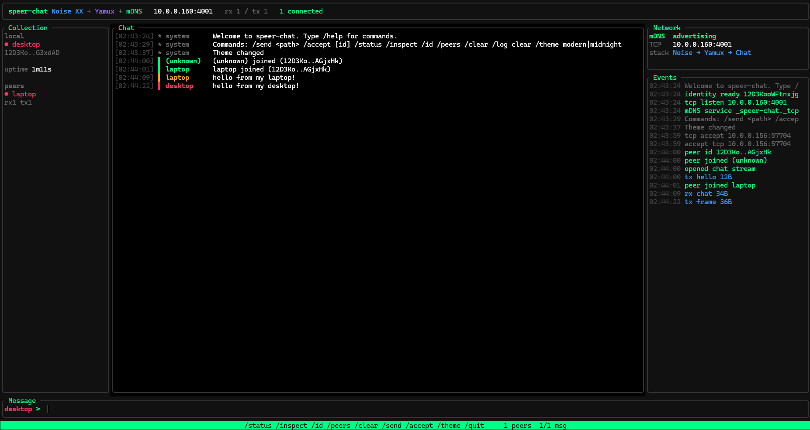

# speer-chat

rust terminal chat app using speer.



it does local discovery with mdns, connects over tcp, negotiates noise xx and
yamux, then speaks `/speer/chat/1.0.0`.

it has chat messages, a small network console, peer stats, themes, and basic
file transfer.

## install

you can install speer with this command
```bash
cargo install speer-chat
```
## run

```bash
cargo run -- --nick alice
cargo run -- --nick bob --theme midnight
```
use a fixed port if you want another client to target this instance:

```bash
cargo run -- --nick alice --port 4001
```

inside the app:

```text
/status /inspect /id /peers /clear /theme /send /accept /quit
```

## commands

- `/status` - local address, uptime, peer count, message stats
- `/inspect` - connection details for each peer
- `/id` - local nick, peer id, and multiaddr
- `/peers` - quick peer list
- `/theme modern|midnight|original` - swap colors
- `/send <path>` - offer a file
- `/accept [id]` - accept an incoming file
- `/quit` - leave

received files go into `speer_received/`.

## build

```bash
cargo check
cargo build --release
```

this crate depends on `speer` with the `full-chat` feature, so it can reach the
lower-level ffi needed for tcp, mdns, noise, yamux, protobuf framing, and peer
ids.
